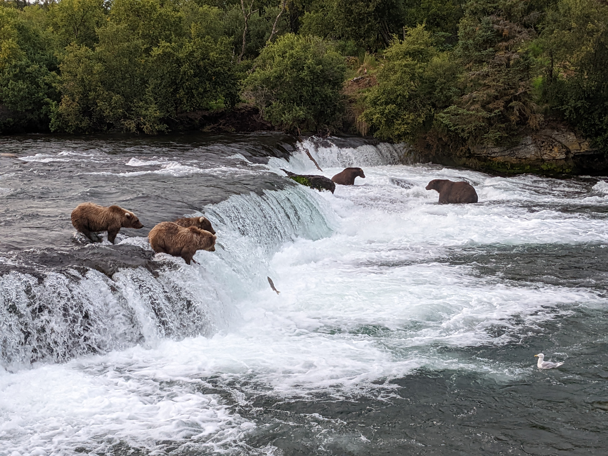
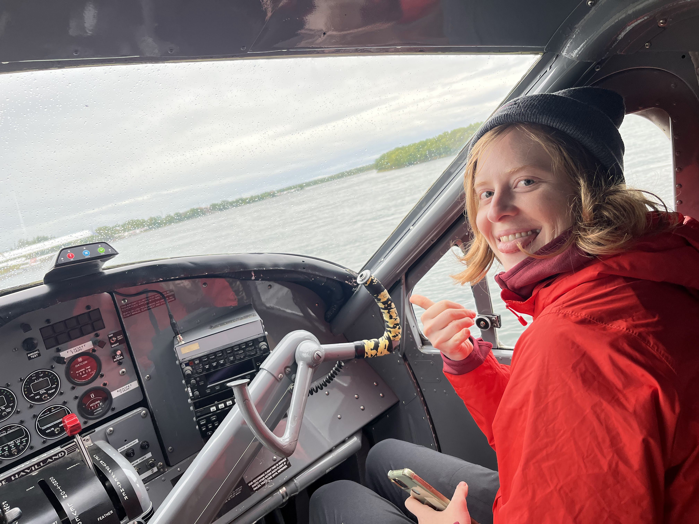

# Meet the Phattest Bears Around
Each year at Katmai National Park, there is a contest of truly _epic_ proportions...

Nestled in the lush embrace of [Katmai National Park](https://www.nps.gov/katm/index.htm), a heavyweight gathering 
like no other unfolds along the banks 
of Brook's River: [Fat Bear Week](https://explore.org/fat-bear-week)...

*Picture taken by me! Fat Bears on the 'lip' at Brooks River*

Behold the 'bear-y' best show in town...These fat bears strut their stuff with a flair for the fabulous, putting the 
'plump' in 
plump-tastic. Visitors flock to witness these roly-poly royalty of the wilderness, as they saunter along the 
riverbank like four-legged celebrities on a red carpet – or should we say, a salmon-hued runway? From Chunk to 
Grazer, every bear is a star, and they've mastered the art of looking fabulous while feasting. So, come for the 
awe-inspiring views, stay for the jaw-dropping pounds – it's a spectacle that's sure to make you 'bear-y' happy you 
came!

## What Does This App Demonstrate?

This app shows demonstrates a Question-Answer chatbot, using Weaviate as the backend vector database & storing chat 
history to enhance user experience.

Your Weaviate index will be filled with user-generated data about notable Fat Bears who live in Katmai National Park. 
With this data as your knowledge store, can ask the chatbot anything about your favorite bears!

Some fun questions include: 
- "What is `the office`?"
  - You can follow up with things like "Is there anything else?"
- "Where is the best place for fishing?"
  - You can follow up with: "What about the jacuzzi?" or "Does 812 like the jacuzzi or the office better?"
- "How many offspring does Grazer have?"
  - You can follow up with: "What are their identities?"

  

# Running the App

## 1. Spin up Weaviate
Note: Ensure you have [Docker](https://docs.docker.com/engine/install/) installed and running. 

In terminal, run `docker-compose up` to get this demo's Weaviate engine up and running with the correct configs.

## 2. Populate Weaviate
**Note:** You will need a _paid_ OpenAI account for this step due to rate-limiting.

### Set the OpenAI environment variable

In terminal, run `export OPENAI_APIKEY=<your API key>` to set your OpenAI API key to the `OPENAI_APIKEY` environment 
variable.

Confirm the variable creation worked by running `echo $OPENAI_APIKEY` in your terminal. This should print out the 
value of your API key. If it doesn't, go back and troubleshoot. 

### Run the startup script
**Note:**  In terminal, run `chmod +x startup.sh` to ensure you permissions to run the script.

Run `./startup.sh` in your terminal. 

Alternatively, you can manually run the python scripts in the `phat_bears` dir,
in the 
following order:
- `gen_schema.py`
- `web_scraper.py`
- `ingestion.py`
  
(There is an example of the scraped data in `data/scraped_data`, if you want to see the expected output and/or use 
  that JSON file instead of running `web_scraper.py`.)

## 3. Run the Flask app
Once your Weaviate engine has all the data in it, you're ready to go! 

Start the app by running `flask --app app run` in your terminal window.

You'll be prompted to input your OpenAI API key. 

**Note:** Your API key will expire after ~30 minutes. When this happens, the app will 
appear broken in the UI. All you need to do is go back to `http://127.0.0.1:5000/` and enter your API key again. 

*A very excited Audrey in a sea plane about to enter Katmai & see the Fat Bears*

# Have fun!
